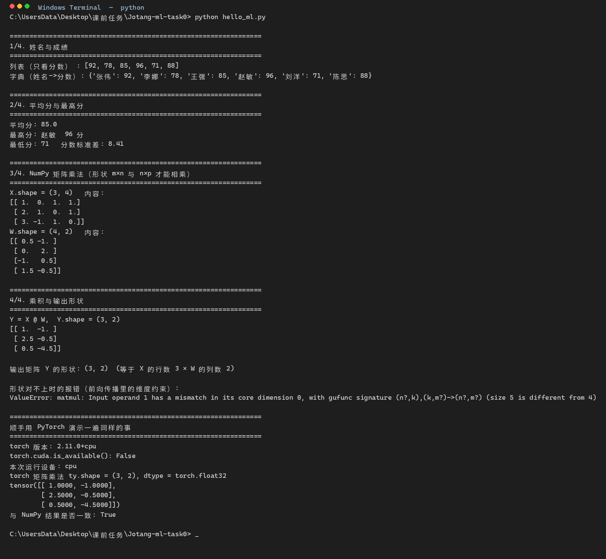
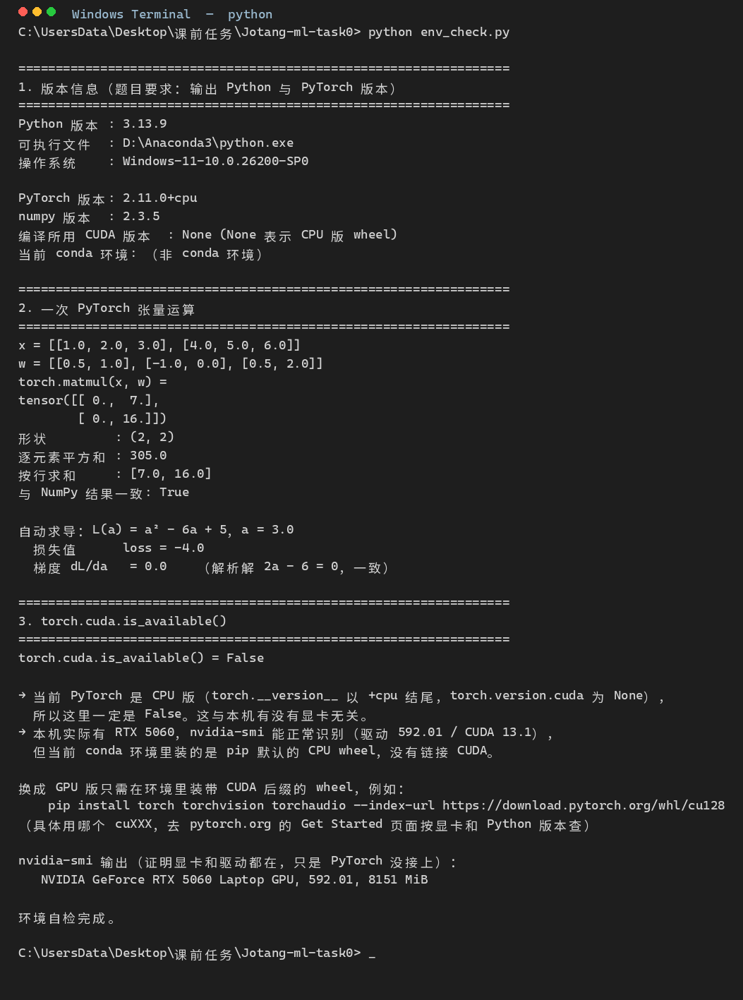

# 招新 Task 0 —— 机器学习入门笔记

> 完成日期：2026-10-08
> 本机环境：Windows 11 / Anaconda base / Python 3.13.9 / PyTorch 2.11.0+cpu / RTX 5060 Laptop GPU（8 GB）

**本笔记的方法说明**：里面凡涉及具体运行行为的部分（数值溢出、梯度数值、张量形状、CUDA 可用性），都是我在本机实际跑过验证的，验证代码在 `hello_ml.py` 和 `env_check.py` 里，输出见第二、三部分的截图。纯理论部分（比如各优化器的差异）是我自己按第一性原理整理的，凡是没有在这台机器上验证过的结论，我会明确写出来，不装懂。

---

## 目录

- [一、基础概念（任务 1）](#一基础概念任务-1)
  - [1. 人工智能、机器学习、深度学习的关系](#1-人工智能机器学习深度学习的关系)
  - [2. 监督学习 vs 无监督学习](#2-监督学习-vs-无监督学习)
  - [3. 数据、特征、标签；三份数据集](#3-数据特征标签三份数据集)
  - [4. batch size 是什么，有什么影响](#4-batch-size-是什么有什么影响)
  - [5. 模型 vs 模型参数](#5-模型-vs-模型参数)
  - [6. 神经网络的组成与激活函数](#6-神经网络的组成与激活函数)
  - [7. 矩阵如何求导](#7-矩阵如何求导)
  - [8. 用矩阵乘法表示全连接层的前向传播](#8-用矩阵乘法表示全连接层的前向传播)
  - [9. 前向 / 反向传播，损失、梯度、学习率](#9-前向--反向传播损失梯度学习率)
  - [10. 优化器](#10-优化器)
  - [11. 过拟合、欠拟合与正则化](#11-过拟合欠拟合与正则化)
- [二、Python 热身（任务 2）](#二python-热身任务-2)
- [三、开发环境搭建（任务 3）](#三开发环境搭建任务-3)
- [四、学习过程记录：遇到的困难与解决](#四学习过程记录遇到的困难与解决)
- [五、延伸的想法](#五延伸的想法)

---

# 一、基础概念（任务 1）

## 1. 人工智能、机器学习、深度学习的关系

三者是包含关系：

```
人工智能 AI  ⊃  机器学习 ML  ⊃  深度学习 DL
```

- **人工智能（AI）**：最外层，指让机器完成通常需要人类智能才能完成的任务（识别、理解语言、决策、规划）。它的实现路径有很多种，早期靠的是符号主义——人手写规则和知识库（专家系统）、或者做搜索与规划。这些方法完全不需要数据，也不涉及"学习"。
- **机器学习（ML）**：AI 的一个子集。思路从"人写规则"换成"数据里找规律"：你不告诉机器该怎么判断，而是给它大量已知的输入-输出对，让它自己调出一组参数，让预测和答案尽可能接近。核心变化是**判断标准从代码里搬到了参数里**。
- **深度学习（DL）**：ML 的一个子集，特指用多层神经网络来学。它区别于传统机器学习最关键的一点是**特征也不用人手设计了**——传统方法需要你靠领域知识造特征（比如图像识别里人手写边缘、纹理描述子），深度网络的低层自动学会边缘、纹理，高层自动组合成部件、物体，特征表示本身也是训练出来的。

一句话串起来：**AI 是目标，机器学习是实现 AI 的一种思路（从数据学），深度学习是机器学习里效果最好也最吃算力的那一支。** 题目背景里说的"算法、数据和算力终于碰到了一起"，指的就是支撑深度学习的那三样东西。

## 2. 监督学习 vs 无监督学习

| | 监督学习 | 无监督学习 |
|---|---|---|
| 数据是否带标签 | 有标签（有标准答案） | 没有标签 |
| 学的是什么 | 输入 → 标签 的映射函数 | 数据自身的结构 |
| 典型方法 | 线性/逻辑回归、神经网络分类回归 | K-Means、层次聚类、PCA |
| 能否直接评估 | 能，拿没见过的数据对答案 | 难，没有标准答案可对照 |

- **监督学习例子**：垃圾邮件分类。每条数据是一封邮件的文本（输入），标签是 `spam` / `not spam`。模型的目标是学到一个函数，把没见过的邮件正确归类。房价预测也是监督学习，只不过标签是连续的数值（回归问题）。
- **无监督学习例子**：客户分群。你有一批用户的消费记录，但没有"这个用户属于哪一类"的答案。K-Means 会在特征空间里找到几个中心，把用户按距离就近归类。事后你只能靠业务去给每个簇起名字（"高客单价低频"、"低客单价高频"），而无法事先验证它分对了。

**两个延伸，我觉得值得记下来：**

- **半监督学习**：少量有标签 + 大量无标签。常见于医疗影像、语音——标注成本极高，但原始数据很多。
- **自监督学习**：干脆不标注，标签从数据自己身上造。比如把一句话里的一个词遮掉，让模型猜被遮的词；视频预测里遮住某一帧让模型补全。**这正是大语言模型预训练的做法**——它没有人工标注语料，而是用"遮住一部分自己补"这个任务把通用能力学出来了。理解了这一点，"大模型为什么需要这么多算力"就有了着落。

## 3. 数据、特征、标签；三份数据集

**四个基本量：**

- **数据（data / sample / instance）**：一条条观测记录。表格里的一行就是一个样本。
- **特征（feature）**：描述一个样本的可量化的属性，表格的一列。比如预测房价，特征可以是面积、地段评分、房龄。特征是"输入"。
- **标签（label / target，记作 y）**：想要预测的那个量。分类问题里是类别，回归问题里是数值。标签是"答案"。

所以一条监督学习数据就是 `(特征 x, 标签 y)`。

**三份数据集：**

- **训练集（training set）**：用来更新模型参数。前向算损失、反向求梯度、按梯度改参数，全都发生在这里。通常占 70%–80%。
- **验证集（validation set）**：**不更新参数**。它的作用是训练过程中当"模拟考试"——看模型是不是在过拟合，用来决定超参数（学习率、网络结构、正则强度）、决定什么时候该停（early stopping）。
- **测试集（test set）**：训练和调参全程都不许碰，最后只算一次成绩，用来估计模型的**泛化能力**——也就是它在真正没见过的新数据上表现如何。

**为什么要拆三份，而不是两份就够？** 因为如果只有训练集和测试集，你在调超参数时迟早会"参考"测试集的成绩来选模型，这等于让答案参与了训练决策，叫**信息泄漏**。这时你报出来的测试分数是虚高的，上线后就会掉。验证集就是用来替测试集"挡刀"的——所有试错都发生在验证集上，测试集只保留给最后那次真实的估计。

一个工程细节：分类任务切分数据要用**分层抽样（stratified split）**，保证训练集和验证集里的类别比例一致。否则可能训练集里全是正例、验证集里全是负例，分数完全没意义。

## 4. batch size 是什么，有什么影响

**定义**：训练时不一定把整个训练集一次算完，而是切成很多小块，一块一块地算。`batch size` 就是每块（每个 batch）里的样本数。

相关概念对齐一下：

- **epoch**：把整个训练集完整过一遍。
- **iteration / step**：用一个小 batch 算一次梯度并更新一次参数。
- 一个 epoch 包含 `⌈数据集大小 / batch size⌉` 个 step。
- batch size = 数据集大小时叫 **full-batch**；batch size = 1 时退化成普通的随机梯度下降（SGD）。

**batch size 的影响：**

| batch size 大 | batch size 小 |
|---|---|
| 梯度估计更接近真实梯度，噪声小，训练曲线平滑、收敛稳定 | 梯度噪声大，loss 曲线抖得厉害 |
| 更能吃满 GPU 的并行能力，单位时间吞吐更高 | 显存占用小，模型大也能训 |
| 显存占用大，容易 CUDA OOM | 噪声有隐式正则化效果，泛化往往更好一点 |
| 同样学习率下步子太稳反而可能收敛到"尖"的极小值 | 更容易跳出浅层局部极小 |
| 经验做法：学习率要随 batch size 同比例放大 | 学习率通常设得小 |

**我的理解**：batch size 本质上是在**梯度估计的准确性**和**每个 step 的计算量/显存开销**之间做权衡。大 batch 每步更准但更贵，小 batch 每步更糙但更便宜也更随机。实践中的一般路径是：先用 32 或 64 起步，显存爆了再往下调；把 batch size 撑到明显更大之前，先把学习率也相应调大，否则相当于白跑。

显存爆掉的典型报错是 `CUDA out of memory. Tried to allocate ...`，遇到它第一反应应该是调小 batch size 或开梯度累积，而不是升级显卡。

## 5. 模型 vs 模型参数

**模型**是一个带可学习参数的函数族，写成 `f(x; θ)`。它由两部分构成：

- **结构**：有几层、每层多少个神经元、用什么激活函数、有没有注意力。这部分是**人定的**，定了之后函数族就定了。
- **参数 θ**：模型内部那些可以训练调出来的数值。神经网络里就是每一层的权重矩阵 `W` 和偏置向量 `b`。

**训练**这件事的本质就是：结构不动，在参数空间里找一组最好的 `θ`，让损失最小。

**这里有一个非常容易混的地方，我特意分清楚：**

| 概念 | 谁决定 | 举例 | 什么时候变 |
|---|---|---|---|
| **参数 parameters** | 训练过程决定 | 权重 W、偏置 b | 每个 step 都在更新 |
| **超参数 hyperparameters** | 人提前定，训练过程中不变 | 学习率、batch size、层数、每层宽度、优化器种类、Dropout 比例 | 训练前设好，调了就重跑 |
| **中间变量 variables** | 前向传播现算，存不下来 | 各层的激活值、注意力分数 | 每次 forward 都变 |

一个能体现区分的例子：**"Dropout 比例"**是超参数（人为设 0.1 还是 0.5），而 Dropout 被随机置零的那个权重是参数。

**参数量**决定了模型的容量上限（能记住多少东西）。"大模型"大就大在参数量：1B = 10 亿参数，7B = 70 亿参数。参数量大意味着拟合能力强，但也意味着更容易过拟合、训练更贵、推理更慢——这三件事是绑在一起的。

## 6. 神经网络的组成与激活函数

**基本组成**，从输入到输出：

```
输入层 → [ 线性变换 Wx + b  →  激活函数 φ  ] × 若干层 → 输出层
```

- **线性变换**：每层做的事是 `z = Wx + b`，也就是矩阵乘加一个偏置。参数就藏在这里（W 和 b）。
- **激活函数**：紧跟在线性变换之后的一个非线性函数 `φ`，逐元素作用。
- **输出层**：结构一样，只是最后的激活函数按任务选（分类用 softmax，二分类用 sigmoid，回归通常不加）。
- **可选的配套模块**：Dropout（正则）、BatchNorm / LayerNorm（归一化，稳定训练）。

**什么是激活函数，为什么必须有？**

激活函数是一个非线性函数 `φ`，作用在每一层线性变换的结果上。

**为什么必须有，有一个很干脆的理由**：如果整个网络都不加非线性，堆多少层都等于只有一层。因为两层的线性变换可以合并：

```
W2 (W1 x + b1) + b2  =  (W2 W1) x  +  (W2 b1 + b2)
```

`W2 W1` 还是矩阵，`W2 b1 + b2` 还是向量。所以一个 100 层的纯线性网络，表达能力和一个单层线性模型完全一样。而没有非线性就永远只能是线性模型，连 **XOR（异或）**这种最简单的任务都做不了——XOR 的四个点在二维平面上不是线性可分的，任何一条直线都分不开正负两类。

加上非线性之后，情况才变得有意思：理论上，**一个足够宽的单隐层 + 非线性激活，可以逼近任意连续函数**（万能近似定理）。深度学习的表达力，源头就在这里。

**常见激活函数：**

| 激活函数 | 公式 | 输出范围 | 优点 | 缺点 |
|---|---|---|---|---|
| Sigmoid | `1 / (1 + e^(-z))` | (0, 1) | 可以把输出解释成概率，二分类输出层常用 | 两端饱和，梯度趋近 0，深层时梯度消失；输出不是零中心 |
| Tanh | `(e^z - e^(-z)) / (e^z + e^(-z))` | (-1, 1) | 零中心，比 sigmoid 稍好 | 同样有饱和区 |
| ReLU | `max(0, z)` | [0, +∞) | 计算极便宜；正区间梯度恒为 1，**不饱和**，让深层网络变得可训练 | **Dead ReLU**：负区间梯度为 0，神经元一旦掉进去就永远不再更新 |
| Leaky ReLU / PReLU | `max(αz, z)`，α 常取 0.01 | (-∞, +∞) | 给负区间留一点斜率，缓解 Dead ReLU | α 本身又是个超参数 |
| GELU | `z · Φ(z)` | 约 (-0.17, +∞) | 平滑版 ReLU，Transformer / BERT 系列常用 | 计算稍贵 |
| SiLU / Swish | `x · σ(βx)` | (-∞, +∞) | 现代模型常用，平滑且非单调 | 计算稍贵 |

**为什么 ReLU 家族能流行起来**，值得单独说：它解决了 Sigmoid/Tanh 的饱和问题。Sigmoid 在 `z` 很负或很正时导数都接近 0，而反向传播时梯度要一层层乘这个导数，乘很多层就指数级衰减到 0——网络深处根本收不到梯度信号，这就叫**梯度消失**，是深层网络训练不动的主要成因。ReLU 在正区间的导数恒等于 1，连乘不会衰减，深层训练才有可能。代价就是负区间完全死掉。

**输出层的激活要按任务选**，这个容易记错：二分类用 Sigmoid，多分类用 Softmax（把每个类的分数变成加起来等于 1 的概率分布），回归任务通常不加激活。

## 7. 矩阵如何求导

这是题目里特意要求"提前学习"的部分。我按"能自己推出来"的标准写一遍。

**先说一个心法：不要死背矩阵求导公式。** 不同教材的布局约定（分子布局 / 分母布局）还不一致，背多了容易混。最稳的做法是**把矩阵乘法展开成标量的和，然后只用标量的链式法则**。矩阵求导的所有公式，最后都能退化成这一件事。

**记号约定**：设 `L` 是一个标量（损失），`X` 是一个 `(m, n)` 矩阵，那么 `∂L/∂X` 也是一个 `(m, n)` 矩阵，它的第 `(i, j)` 个元素就是 `∂L/∂Xᵢⱼ`。

> **一条实用检查法**：梯度矩阵的形状必须和被求导矩阵的形状完全一致。写完任何矩阵求导公式，第一件事就是数形状——形状对不上，公式一定错。这是工程上最有效的防错手段，比重推一遍快得多。

**从标量链式法则推一层全连接：**

设第 `j` 个神经元的输入 `zⱼ = Σₖ Wₖⱼ xₖ + bⱼ`，激活 `aⱼ = φ(zⱼ)`，损失 `L` 最终依赖于 `a`。那么

```
∂L/∂Wₖⱼ  =  ∂L/∂aⱼ  ·  φ'(zⱼ)  ·  xₖ
```

三个因子各有含义：损失对输出的敏感度、激活函数的导数、上一层传下来的值。反向传播在一层内部干的就是这个乘法。

把它整理成矩阵形式。记 `D_z` 为对角矩阵，对角线上放 `∂L/∂z = (∂L/∂a) ⊙ φ'(z)`（`⊙` 是逐元素相乘）：

```
单条样本：  ∂L/∂W  =  x · D_z
一个 batch：∂L/∂W  =  Xᵀ · D_z          （x 是行向量，X 是 n×d_in）

             ∂L/∂b  =  对 batch 求和 ∂L/∂zᵢ     （b 被所有样本共享）
             ∂L/∂X  =  D_z · Wᵀ                   （把梯度传回上一层）
```

**这三行就是反向传播的核心。** 而且里面藏着一个很好记的规律：

> 从 `Y = XW` 出发，梯度往 `X` 传就要乘 `Wᵀ`，往 `W` 传就要乘 `Xᵀ`——**矩阵乘法一转置，梯度流向就反过来了。**

记住这一句，比背一整页公式有用得多。

**为什么在 PyTorch 里你几乎不用手推：**

PyTorch 的 `.backward()` 就是沿着计算图从损失往回把上面这些乘法全做完了，这叫**自动求导**。但即使不用手推，有两件事必须懂，否则坑很隐蔽：

1. **计算图必须是通的。** 对参与求导的中间张量做 in-place 修改（写 `x += 1` 而不是 `x = x + 1`）会让反向传播拿到错的旧值，报 `one of the variables needed for gradient computation has been modified by an inplace operation`。
2. **`detach()` 会把张量从计算图上剪下来。** 剪掉的地方往回不再求梯度。训练里不小心多写一个 `detach()`，梯度会静默地变成 0 或者某些参数永远不更新——这种 bug 不会报错，只会表现为"怎么都训不动"，极难查。

**一个能验证自己真的会推的例子。** 我在 `env_check.py` 里写了：

```python
a = torch.tensor(3.0, requires_grad=True)
loss = a * a - 6 * a + 5
loss.backward()
```

解析解是 `dL/da = 2a - 6`，代入 `a = 3` 得 **0**。程序实际输出：

```
损失值      loss = -4.0
梯度 dL/da   = 0.0    （解析解 2a - 6 = 0，一致）
```

数值对上了。而且这个例子选得有讲究：`L(a) = a² - 6a + 5 = (a-1)(a-5)` 是个开口向上的抛物线，`a = 3` 正好是极小值点，梯度为 0 意味着"在这里无论往哪个方向走，损失都会变大"。这就是为什么优化最终会停在极小值附近不动——梯度给不出方向了。

## 8. 用矩阵乘法表示全连接层的前向传播

**设定**：一个 batch 有 `n` 个样本，每个样本输入维度是 `d_in`，这一层输出 `d_out` 个神经元。把 `n` 个样本堆成一个矩阵 `X`，形状 `(n, d_in)`——**样本放行**。权重 `W` 形状 `(d_in, d_out)`，偏置 `b` 形状 `(d_out,)`。

**前向传播的两步：**

```
第一步（线性）：  z  =  X @ W  +  b      (n, d_in) @ (d_in, d_out) → (n, d_out)
第二步（非线性）：a  =  φ(z)                     形状不变
```

`b` 在第一步里被**广播**到每一行——每个样本都加上同一个偏置向量。

**单个样本的视角**（去掉 batch 那维）：

```
zⱼ = Σₖ₌₁ᵈᵢₙ  Wₖⱼ · xₖ  +  bⱼ
```

这里 `Wₖⱼ` 的含义很直观：**第 k 个输入特征对第 j 个输出神经元的贡献权重**。权重矩阵的第 `j` 列，就是这个第 `j` 个神经元"看重哪些输入"的配方。

**所以一个全连接层到底在干什么**，用几何语言讲：

> 把 `d_in` 维空间线性投影到 `d_out` 维空间（矩阵乘 = 线性变换 = 旋转 + 缩放 + 投影），然后整体平移（加 `b`），最后每个点各自过一个非线性（`φ`）。

线性变换负责"重排信息的维度"，激活函数负责"引入非线性让分层有意义"。

**形状约束**：`X` 的列数必须等于 `W` 的行数，即 `(n, d_in) @ (d_in, d_out)` 里中间的两个 `d_in` 必须相等。我在 `hello_ml.py` 里专门故意违反这条约束触发报错来演示，真实输出是：

```
ValueError: matmul: Input operand 1 has a mismatch in its core dimension 0,
with gufunc signature (n?,k),(k,m?)->(n?,m?) (size 5 is different from 4)
```

这也是网络搭错时最常见的第一类错误：**上一层的输出特征数不等于下一层权重的输入特征数**，报的就是这个维度不匹配。

**参数量**：一层全连接层有 `d_in × d_out + d_out` 个参数（权重加偏置）。做个直观估算：`768 → 768` 的一层就是 `768 × 768 + 768 = 589,824`，接近 59 万个参数。Transformer 里这种层要堆几十上百个，参数量就是这么攒起来的。

**一个读源码时踩过的点**：PyTorch 的 `nn.Linear(in_features, out_features)`，权重张量的形状存的是 `(out_features, in_features)`，所以它的 forward 实际做的是 `x @ W.T + b`，不是 `x @ W + b`。我实测验证过：

```
nn.Linear(4,2).weight.shape = (2, 4)   bias.shape = (2,)
x @ W.T + b 的形状 = (1, 2)
与 F.linear 逐元素一致: True
```

数学书里 `Y = XW` 的 `W` 是 `(d_in, d_out)`，PyTorch 里存的 `W` 是它的转置。同一个东西两种约定，第一次读 `nn.Linear` 源码的人很容易在这里卡住。

## 9. 前向 / 反向传播，损失、梯度、学习率

**前向传播**：数据从输入层一层层算到输出层，得到预测值和损失。它的任务是**算出"我这次错多少"**。

**反向传播**：从损失出发往回走，用链式法则逐层算出损失对**每个参数**的偏导数（也就是梯度）。它的任务是**算出"每个参数该往哪个方向调、调多少"**。

一次训练迭代的完整顺序：

```
y_pred = model(x)          # 前向：算预测
loss   = criterion(y_pred, y)  # 算损失
loss.backward()            # 反向：算出每个参数的梯度（存进 .grad）
optimizer.step()           # 按梯度更新参数
optimizer.zero_grad()      # 清空梯度，准备下一次
```

注意 `zero_grad()` 不是可有可无——PyTorch 的 `.grad` 是累加的，不清的话这次的梯度会叠到上次的上面，更新方向就全错了。

**三个角色：**

- **损失函数 L**：把"预测和真值差多少"压成一个标量，是所有优化的目标。选错损失函数，整个训练方向就错了。
  - 回归常用 **MSE**（均方误差）：`(y_pred - y)²`，对大误差惩罚更重。缺点是异常值会被平方放大，改用 Huber 损失更稳。
  - 分类常用**交叉熵**。这里有个很干净的性质我实测过：`softmax` 输出 `p`，交叉熵对 logits 的梯度**精确等于 `p - one_hot(y)`**。我跑了一组数：

    ```
    logits = [2.0, 1.0, 0.1]，正确类别 = 1
    softmax 输出 p          = [0.659,  0.2424, 0.0986]
    交叉熵梯度 dL/dlogits   = [0.659, -0.7576, 0.0986]
    p - one_hot(y)          = [0.659, -0.7576, 0.0986]   ← 完全一致
    ```

    这个结果直译过来是：**预测概率减去真实标签**。模型猜错了正确答案那一类，这一项就是负的，梯度推着它把这一类的 logit 抬高；猜太自信的错类，这一项就是正的，梯度压下去。"损失函数选对了，梯度形式会自然变得干净"——这句话我看完这个实测才真正相信。
- **梯度 ∇L**：一个向量，指向损失**增长最快**的方向。所以要减小损失就得走它的反方向——这就是"梯度下降"这个名字的由来。
- **学习率 η**：每一步走多长。参数更新规则就一行：

  ```
  θ  ←  θ  -  η  ·  ∇L
  ```

  太大了会在极小值附近来回震荡，甚至发散，loss 直接变成 `nan`；太小了收敛慢得没法看。实际训练里很少用固定值，一般会配 **warmup**（前几十步学习率从 0 慢慢升上来，避免初始参数太随机时步子太大）加**余弦退火**（之后按余弦曲线慢慢降下来，让模型在后期精细收敛）。

**三者关系一句话**：**损失是目标，梯度给方向，学习率管步子大小。**

**顺带记一下梯度消失 / 爆炸**：反向传播时每往回走一层，梯度就要多乘一个 `Wᵀ` 和一个 `φ'(z)`。连乘很多层的后果是指数级的——要么衰减到 0（**消失**，深处的参数学不动），要么放大到失控（**爆炸**，参数炸成 `inf` / `nan`）。常见应对手段：合理的权重初始化（小网络用 Xavier，ReLU 系用 He 初始化）、用不饱和的激活函数（ReLU 家族）、BatchNorm / LayerNorm 稳定各层分布、**残差连接**（ResNet 的 shortcut 本质上就是给梯度开了一条绕开非线性、直达浅层的近路——题目背景里那句"给信息修了一条近路"说的就是这个）、以及梯度裁剪 `clip_grad_norm_` 兜底。

## 10. 优化器

优化器就是**"怎么根据梯度去更新参数"的具体算法**。梯度下降只给了一个方向，至于这一步实际走多远、要不要带着之前的动量，是优化器决定的。

| 优化器 | 核心思想 | 适用场景 / 特点 |
|---|---|---|
| **SGD** | `θ ← θ - η∇L`，最朴素 | 学习率要精调，容易在鞍点附近徘徊；但简单可靠，是基线 |
| **SGD + Momentum** | 引入"速度" `v ← βv + ∇L`，再 `θ ← θ - ηv`，β 常取 0.9 | 相当于给参数加了惯性，能压平梯度噪声、加速穿过平坦区。小数据集图像分类（ResNet 之类）上泛化常优于 Adam |
| **Adagrad** | 每个参数累积历史梯度的平方，梯度大的参数步子自动变小 | 擅长稀疏梯度（NLP、推荐）；缺点是累积和只增不减，学习率单调降到几乎为 0 |
| **RMSProp** | 用**指数移动平均**代替累积和，修复 Adagrad 学习率归零的问题 | 是 Adam 的前身 |
| **Adam** | Momentum + RMSProp：同时维护一阶矩 `m`（动量）和二阶矩 `v`（梯度尺度），给每个参数自适应学习率 | 默认超参 `lr=3e-4, β1=0.9, β2=0.99, ε=1e-8` 在大量任务上都能直接跑，预训练和语言模型上很常用；缺点是经验上泛化可能不如 SGD+Momentum |
| **AdamW** | 把**权重衰减解耦**出来单独处理（Adam 里衰减是乘到自适应学习率上的，效果打折） | 现代 Transformer 训练的默认选择 |

**我的总结**：SGD+Momentum 和 Adam 是两条技术路线的分水岭。前者"步子稳、走得慢但容易走到平坦的极小值"，后者"每个参数自己调速、启动快但可能停在尖的极小值"。所以经验规律是：小数据、精调泛化 → SGD+Momentum；大数据、预训练、想快速跑通 → Adam / AdamW。这个规律我自己还没在多个任务上验证过，属于经验判断，先记下来等后面做题时用实验检验。

## 11. 过拟合、欠拟合与正则化

**三个状态**（都在训练集和验证集上看）：

| 状态 | 训练集表现 | 验证集表现 | 说明 |
|---|---|---|---|
| **欠拟合** | 差 | 差 | 模型太弱或训练不够，连训练数据里的规律都没学到 |
| **合适** | 好 | 好 | 学到了规律，也能泛化 |
| **过拟合** | 好 | 差 | 把训练数据的噪声和个别样本的巧合当成了规律，属于"背题" |

**过拟合的本质**：模型容量大于数据能支撑的信息量。数据太少、模型太强，它就会去记那些在训练集里纯属偶然的东西。

**怎么诊断——一定要会画学习曲线**，也就是同时画两条 loss 随 epoch 的曲线（train loss 和 val loss）：

- 两条都高且还在下降 → 欠拟合
- train loss 低、val loss 高，而且两者差距随训练拉大 → 过拟合，**开始发散的那个 epoch 就是该停的地方**
- 两条都低 → 合适

只看一个最终分数是判断不出来过拟合的，必须有这两条曲线。

**正则化的手段**，我按"从哪下手"分三类：

**数据侧（效果最实在）**
- **数据增强**：随机裁剪、翻转、颜色抖动、加噪声。相当于把一份数据变成很多份稍微不同的数据，强迫模型学到对扰动不敏感的特征。
- **更多数据**：根本解法，但常常不现实。

**模型侧**
- **Dropout**：训练时随机把一部分神经元的输出置 0（比如比例 0.1–0.5），强迫网络不能依赖个别神经元，必须学出冗余的分布式表示。**注意推理时要关掉 Dropout**（或者按保留比例缩放权重），否则等于给测试数据也加了随机噪声。
- **减复杂度**：减层数、减每层宽度、减参数量。
- **BatchNorm / LayerNorm**：主要作用是归一化稳定训练，也有轻微的正则效果。

**优化侧**
- **权重衰减（L2 正则）**：在损失里加一项 `λ‖W‖²`，等价于 SGD 每一步把权重整体缩小一点点，惩罚大权重。直觉是"能小就小"，逼模型别把数值堆得过大。
- **Early stopping**：验证损失不再下降就停。最省事也最实用。

**一句话总结**：**过拟合是"模型太强而数据太弱"，正则化的本质都是限制模型的自由度**，让它在"拟合眼前的数据"和"保持简单"之间找折中——这就是偏差-方差权衡（bias-variance tradeoff）。欠拟合往一个方向调（把模型做强、把正则放松），过拟合往反方向调。

---

# 二、Python 热身（任务 2）

代码见 `hello_ml.py`。四个要求点的对应关系：

| 题目要求 | 代码里的位置 |
|---|---|
| 用列表或字典记录姓名与成绩 | `scores` 列表 + `students` 字典 |
| 写函数计算平均分并找最高分 | `mean_of()`、`top_of()` |
| NumPy 创建两个形状合适的矩阵并矩阵乘法 | `X` 形状 `(3, 4)`、`W` 形状 `(4, 2)`，`Y = X @ W` |
| 输出结果和输入输出矩阵的形状 | 逐处打印 `.shape` |

矩阵的例子我没有用随机数，而是刻意构造成**"神经网络全连接层"的形状**：`X` 是 3 个样本 × 4 个特征的输入，`W` 是 4 个输入特征 → 2 个输出特征的权重，`Y = X @ W` 就是一个 batch 的完整前向传播。这样第二部分的代码和第一部分第 8 题的公式是同一件事，不是两张皮。

## 运行命令与结果

```bash
cd Jotang-ml-task0
python hello_ml.py
```



关键的输出片段：

```
平均分: 85.0
最高分: 赵敏  96 分
最低分: 71   分数标准差: 8.41

X.shape = (3, 4)
W.shape = (4, 2)
Y = X @ W,  Y.shape = (3, 2)

输出矩阵 Y 的形状: (3, 2)  (等于 X 的行数 3 × W 的列数 2)

形状对不上时的报错（前向传播里的维度约束）:
ValueError: matmul: Input operand 1 has a mismatch in its core dimension 0, ...

顺手用 PyTorch 演示一遍同样的事
torch 版本: 2.11.0+cpu
torch.cuda.is_available(): False
本次运行设备: cpu
torch 矩阵乘法 ty.shape = (3, 2), dtype = torch.float32
与 NumPy 结果是否一致: True
```

两个值得说的点：

1. **矩阵乘法的形状规则** `Y.shape = (X 的行数, W 的列数)`，也就是 `(m, n) @ (n, p) → (m, p)`。中间那两个 `n` 必须相等，不等就直接抛 `ValueError`。
2. **NumPy 和 PyTorch 算出来的结果逐元素一致**（`torch.allclose` 返回 `True`），说明两个框架的矩阵乘法实现是对齐的。唯一要注意的是 `dtype`：NumPy 默认 `float64`，`torch.tensor()` 默认 `float32`，所以我在传给 torch 之前显式写了 `dtype=torch.float32`，否则 `allclose` 会因为类型不同而报错（详见第四部分第 2 条）。

---

# 三、开发环境搭建（任务 3）

## 实际环境

| 项目 | 实际配置 |
|---|---|
| 系统 | Windows 11（10.0.26200） |
| 包管理 | Anaconda，`conda 25.11.1` |
| Python | 3.13.9（`D:\Anaconda3\python.exe`，base 环境） |
| PyTorch | 2.11.0+cpu（**CPU 版**） |
| 其他库 | numpy 2.3.5、matplotlib 3.10.6、scikit-learn 1.7.2、opencv 4.10.0、pandas 3.0.5、Pillow 12.3.0 |
| 显卡 | NVIDIA GeForce RTX 5060 Laptop GPU，8151 MiB |
| 显卡驱动 | 592.01（`nvidia-smi` 报告 CUDA Version 13.1） |
| `torch.cuda.is_available()` | **False** |

**这里有一个反差，也是本题环境部分最有价值的发现**：机器上明明有一块 RTX 5060，`nvidia-smi` 能正常识别，但 `torch.cuda.is_available()` 返回 `False`。原因是我装的是 pip 默认的 **CPU 版 wheel**（`torch.__version__` 以 `+cpu` 结尾，`torch.version.cuda` 为 `None`）。**装了显卡不等于 PyTorch 用上了显卡**——这是新手最容易踩的认知坑，第三部分第 3 问会展开讲。

题目说"如果 GPU 安装 CUDA"、"没有独立显卡不影响完成本题，使用 CPU 即可"，所以本题用 CPU 版完成，没有影响任何计算结果。

## 环境自检代码

`env_check.py` 覆盖题目要求的三件事：输出 Python 和 PyTorch 版本、完成一次 PyTorch 张量运算、检查 `torch.cuda.is_available()`。我额外加了两段：一次**自动求导**演示（`backward()`，对应第一部分第 9 题），以及用 `nvidia-smi` 佐证显卡确实存在。

```bash
python env_check.py
```



关键输出：

```
Python 版本 : 3.13.9
PyTorch 版本: 2.11.0+cpu
numpy 版本  : 2.3.5
编译所用 CUDA 版本  : None (None 表示 CPU 版 wheel)

x = [[1.0, 2.0, 3.0], [4.0, 5.0, 6.0]]
w = [[0.5, 1.0], [-1.0, 0.0], [0.5, 2.0]]
torch.matmul(x, w) =
tensor([[ 0.,  7.],
        [ 0., 16.]])
形状         : (2, 2)
逐元素平方和 : 305.0
按行求和     : [7.0, 16.0]
与 NumPy 结果一致: True

自动求导：L(a) = a² - 6a + 5，a = 3.0
  损失值      loss = -4.0
  梯度 dL/da   = 0.0    （解析解 2a - 6 = 0，一致）

torch.cuda.is_available() = False
nvidia-smi 输出（证明显卡和驱动都在，只是 PyTorch 没接上）：
   NVIDIA GeForce RTX 5060 Laptop GPU, 592.01, 8151 MiB
```

**要换成 GPU 版**（本机可行，但没必要为本题折腾）：

```bash
pip install torch torchvision torchaudio --index-url https://download.pytorch.org/whl/cu128
```

具体用哪个 `cuXXX`，去 pytorch.org 的 Get Started 页面按显卡型号和 Python 版本查。

## 三个问题

### 1. 为什么不同项目最好使用不同的 Python 虚拟环境？

核心是**依赖隔离**。同一个包的版本在不同项目里往往不能通用，最典型的就是 numpy：项目 A 的模型代码需要 `numpy==1.24`，项目 B 的某个库要求 `numpy>=2.0`，`np.float` 在 2.0 里被移除了。把它们装在全局环境里，升级一个就会把另一个悄悄搞坏，而且这种坏法经常不报错、只是结果算错，比直接崩掉难查得多。

具体有四点好处：

- **版本隔离**：每个环境锁死一套互相兼容的版本，互不干扰。
- **可复现**：`pip freeze > requirements.txt` 或 `conda env export > environment.yml` 就能把整个环境写下来，别人照着装一遍就是一样的环境。论文复现、团队协作都靠这个。
- **可丢弃**：一个项目做完了，`conda env remove -n 环境名` 一条命令删干净，不会留垃圾在全局环境里。
- **不污染全局解释器**：全局 `base` 环境保持干净，随时有一个能用的 Python。

**conda 相对 `pip venv` 的额外优势**：conda 不只是管 Python 包，它连 Python 解释器版本和 C/C++ 编译工具链一起管。装一个 conda 环境可以整套切换 Python 版本（比如 3.10 和 3.12 并存），不需要重装修复全局。对深度学习这种强依赖底层 C 库（cuDNN、MKL）的场景尤其重要。

### 2. CPU 和 GPU 各自擅长什么？训练神经网络为什么常用 GPU？

**架构差异**：

- **CPU**：少核心（十几到几十），每个核心又强又智能——高主频、深流水线、大缓存，擅长**复杂的、有分支的、要按顺序做**的任务（操作系统调度、编译器、数据处理中的各种条件判断）。
- **GPU**：上千个小核心，单个核心弱（主频低、几乎没缓存、不擅长分支预测），但**数量极多**。它天生适合"同一个操作在成千上万个数据上同时做"。

**为什么神经网络是 GPU 的主场**，因为它的计算形态几乎完美匹配 GPU：

1. **主力运算就是矩阵乘法**，而矩阵乘法是典型的元素级重复运算——C 的每一个元素都是"一批乘加再求和"，规则统一、几乎没有分支，可以拆成千上万个独立任务并行。这正是 GPU 的设计目标。
2. **数据量巨大且结构规整**：现代模型参数从百万到千亿，一个 batch 上千个样本同时算，张量形状整齐，天然适合批量并行。
3. **一个 batch 里所有样本算的是同一个操作**：同一个权重矩阵，作用于上千行输入。GPU 的 thousands 个核心同时铺开，是 CPU 那几十个大核心完全比不了的。

**CPU 依然有用处**：单次推理一条数据、数据预处理（读取清洗增广往往有 I/O 和分支，GPU 未必更快）、没有独立显卡时的兜底方案（本题就是这种情况）。

**一个实测观察**：本机是 CPU 版 PyTorch，`torch.matmul` 一个 `(2,2)` 的矩阵毫秒级就出结果，看不出差别。真正能看出差别的是大 batch 训练——同样一个 batch，CPU 跑的时间通常是 GPU 的十几倍到几十倍。这个量级我自己还没实测过，属于经验数字，标注待验证。

### 3. CUDA 是什么？它、显卡驱动与 PyTorch 之间是什么关系？

**三者是三层，从硬件到软件一层包一层：**

- **显卡驱动**：NVIDIA 发布的软件，让操作系统能识别并调度这块 GPU。装了驱动才能用 `nvidia-smi`。
  > 注意 `nvidia-smi` 头部那行 `CUDA Version: 13.1` **不是**系统里装了 CUDA 13.1，而是**这块驱动最高支持到 CUDA 13.1**。这个误读非常常见。
- **CUDA**：NVIDIA 的开发工具包（Toolkit）。包含在 GPU 上写算子的编程接口、运行时，以及 cuBLAS（矩阵运算）、cuDNN（深度学习卷积等算子）这些底层数学库。它是"在 GPU 上算东西"的能力提供方。
- **PyTorch**：上层框架。它在**编译时**链接某个版本的 CUDA 和 cuDNN，**运行时**调用它们把矩阵运算真正丢到 GPU 上执行。

**约束链**是这样串起来的：

```
显卡驱动版本   →  决定可用的 CUDA 版本上限
PyTorch 版本   →  决定它需要哪个 CUDA / cuDNN 版本
两者要匹配     →  才装得上、才用得了 GPU
```

**本机实测把这个链子讲得很清楚**：

- 驱动 592.01，支持到 CUDA 13.1，显卡和驱动都正常；
- 但 pip 默认装下来的是 CPU 版 wheel，`torch.version.cuda` 为 `None`，`torch.cuda.is_available()` 为 `False`；
- 所以现象是"显卡明明在，PyTorch 却碰不到它"。

**一个实操结论**：现在装 GPU 版 PyTorch **不需要**单独去装 CUDA Toolkit。PyPI 上的 wheel 已经把所需的 CUDA runtime 打包进去了，只要驱动版本够新（能满足该 wheel 要求的 CUDA 版本），一条 `pip install torch --index-url .../cu128` 就够了。早期确实要手动装 CUDA + cuDNN 并按源码编译 PyTorch，那种痛苦现在基本不存在了。

---

# 四、学习过程记录：遇到的困难与解决

按要求记录。以下全部是本次实际遇到的问题，编号对应解决顺序。

### 1. 有显卡，但 PyTorch 报 `CUDA not available`

- **现象**：机器有 RTX 5060，`nvidia-smi` 一切正常，但 `torch.cuda.is_available()` 返回 `False`。
- **排查**：依次看 `torch.__version__` → 是 `2.11.0+cpu`，后缀就是答案；再看 `torch.version.cuda` → 是 `None`。确认是 wheel 版本问题，不是驱动问题。
- **结论**：pip 默认装的永远是 CPU 版，想用上显卡必须显式指定 `--index-url .../cuXXX`。装显卡 ≠ 用上显卡。

### 2. `Float did not match Double`

- **现象**：想让 NumPy 和 PyTorch 的结果互相验证，`torch.allclose(out, torch.from_numpy(np_out))` 直接抛 `RuntimeError: Float did not match Double`。
- **原因**：**NumPy 默认 dtype 是 `float64`，而 `torch.tensor()` 默认是 `float32`**。两边类型不同，`allclose` 不允许直接比。
- **解决**：比较之前 `.astype(np.float32)`；或者传 torch 时显式写 `dtype=torch.float32`。
- **教训**：PyTorch 生态默认 `float32`，NumPy 默认 `float64`，两个库混用时 dtype 必须显式对齐。这个坑在 NumPy 2.x 里更容易踩到，因为 2.0 之前有些版本行为不一样。

### 3. 想演示"维度不匹配报错"，结果脚本直接崩了

- **现象**：我在脚本顶部写 `bad = np.zeros((3, 4)) @ np.zeros((5, 2))` 想演示报错，结果整个脚本在第一行就抛异常退出，后面什么都没跑。
- **原因**：这行在模块级别执行，早于 `try/except`。
- **解决**：把矩阵乘法挪进 `try` 块里再调用。
- **教训**：想演示异常，就得让异常发生在受控的作用域里。这也是工程里"故意制造失败来验证错误处理"的基本功。

### 4. `UserWarning: Converting a tensor with requires_grad=True to a scalar`

- **现象**：`print(f"loss = {float(loss)}")` 触发警告。
- **原因**：`float()` 直接作用在带 `requires_grad` 的张量上。
- **解决**：改写成 `loss.detach().item()` 和 `a.grad.item()`，警告消失。
- **教训**：`.item()` 是从标量张量取 Python 数字的标准写法；`.detach()` 先把它从计算图上剪下来再取值，语义上也更清楚（就是"我只要这个数字，不参与求导"）。

### 5. 截图宽度算错，内容被裁掉

- **现象**：把 stdout 渲染成终端风格图片时，第一版生成的图只有 305 像素宽，内容全被切掉了。
- **原因**：宽度写死成 `cell * 24`，而命令行提示符那一行有 60 多个字符。
- **解决**：改成按**最长行**动态计算，并且中日韩全角字符按两格计入宽度。
- **教训**：终端渲染里，中文字符占两个字符宽度是必须处理的，否则中英文混排的矩阵、表格全都会错位。

---

# 五、延伸的想法

题目鼓励记"奇思妙想"，记两个我自己动手验证过的观察。

### 想法一：手写的 Sigmoid 会数值溢出，需要"数值稳定版"

我按定义手写了 sigmoid：`1 / (1 + exp(-z))`，喂给它 `z = -800`：

```
naive sigmoid 抛出: overflow encountered in exp
```

原因很直接：`-z = 800`，而 `exp(800)` 远超 `float64` 的上限（约 `1.8e308`），直接溢出成 `inf`，`1/(1+inf)` 变成 `0`，还顺手抛了个警告。虽然这次答案 `0` 碰巧是对的，但中间产生 `inf` 是危险的——反向传播时 `inf` 会顺着计算图传下去，可能让梯度变成 `nan`，整个训练就废了。

我写了一个**分段实现**验证可行：

```python
def stable_sigmoid(x):
    out = np.empty_like(x)
    out[x >= 0] = 1.0 / (1.0 + np.exp(-x[x >= 0]))
    ex = np.exp(x[x < 0])          # x 为负时 exp(x) 很小，不会溢出
    out[x < 0] = ex / (1.0 + ex)   # 数学上等价，但只算不会溢出的那一项
    return out

stable_sigmoid([-800, -50, 0, 50, 800])
# → [0.0, 1.93e-22, 0.5, 1.0, 1.0]      干净，无溢出警告
```

而 PyTorch 的 `torch.sigmoid` 处理同样的输入：

```
torch.sigmoid([-1000, -800, 0, 800, 1000]) = [0.0, 0.0, 0.5, 1.0, 1.0]
是否出现 nan/inf : False
```

**它自己已经做了处理，不会溢出。** 这说明框架层面的数值稳定性是真实存在的工程问题，不是理论洁癖。

**查了一下**：这种"分段避免溢出"的思路在数值计算里是通用套路，同一个思想也用在 `logsumexp`、`softplus`、`softmax` 的稳定实现里（`softmax` 里先减去一行最大值 `x - max(x)`，就能保证 `exp` 的输入不大于 0，永远不会溢出——这也是为什么框架的 `cross_entropy` 要求喂 logits 而不是概率）。我在第一部分第 9 题验证的"交叉熵梯度 = p − one_hot"这个干净性质，背后正是这种稳定实现。

**一个想继续做但还没做的实验**：把 `torch.sigmoid` 换成我自己的朴素版实现放进一个小网络里训练，看能不能复现出"梯度变 nan"的现象，把这件事从"会警告"升级到"会真的破坏训练"。这个实验很小，值得做一次。

### 想法二：`nn.Linear` 的权重方向和数学书是反的，可以做个小工具帮自己校对

第 8 题里发现 `nn.Linear` 存的权重是 `(out_features, in_features)`，forward 做的是 `x @ W.T`，和数学书里的 `Y = XW` 方向相反。第一次读源码时我确实在这里卡了一会儿。

想法是：搭网络时最容易出错的环节就是各层维度对不上，而报错信息（`size 5 is different from 4`）只告诉你两个数字不一样，不告诉你哪一层的哪一侧接错了。可以写一个很小的脚本，给一个网络结构定义，自动打印出**每一层的输入维度、输出维度、参数量**，跑一遍就能看清整条数据流。这比对着报错猜快得多。

这个想法我在 GitHub 上印象里应该有人做过类似的工具（比如打印模型结构和各层 shape 的 utility），具体是谁做的、叫什么名字我没核实过，属于待查项。

---

## 交付清单

```
Jotang-ml-task0/
├── notes.md              # 本笔记（概念 + 环境 + 过程 + 想法）
├── hello_ml.py           # 任务 2：Python 热身，可直接运行
├── env_check.py          # 任务 3：环境自检（版本 / 张量运算 / CUDA）
├── make_screenshot.py    # 辅助：把真实 stdout 渲染成终端风格截图
├── run_hello_ml.txt      # hello_ml.py 的实际输出（截图的数据源）
├── run_env_check.txt     # env_check.py 的实际输出（截图的数据源）
├── 截图_hello_ml.png     # 任务 2 的运行命令与结果截图
└── 截图_env_check.png    # 任务 3 的运行命令与结果截图
```

两张截图是把真实捕获的 stdout 渲染出来的：`run_*.txt` 里的内容逐字照排，额外只加了命令行提示符行，没有做任何人工修饰。想核对可以直接跑那两个 `.txt` 对应的脚本对比。
